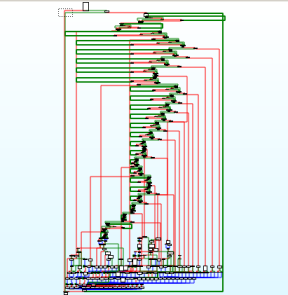
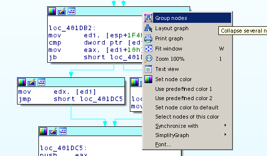
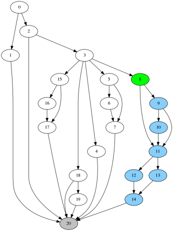
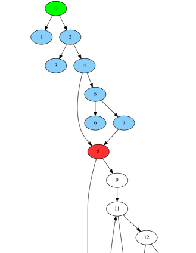
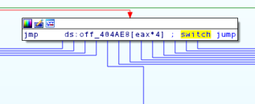
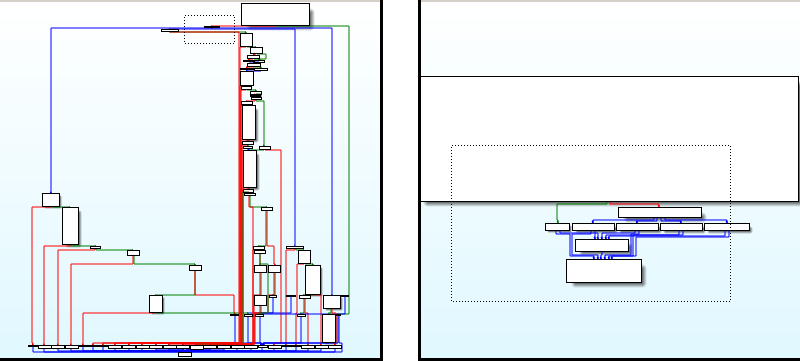
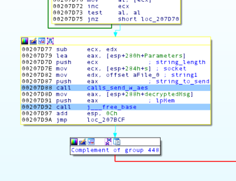
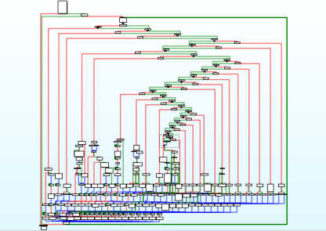
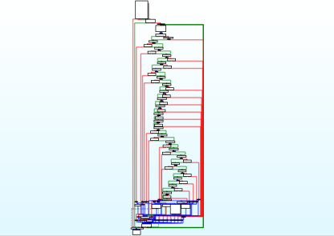
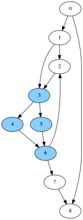

## SimplifyGraph - [3rd place winner of the 2017 Hex-Rays IDA Pro Plugin Contest](https://www.hex-rays.com/contests/2017/index.shtml)

# Background
My personal preference is to use IDA’s Graph mode when doing the majority of my reverse engineering. It provides a graphical representation of the control flow graph and gives visual cues about the structure of the current function that helps me better understand the disassembly.

Graph mode is great until the function becomes complex. IDA is often forced to place adjacent nodes relatively far apart, or have edges in the graph cross and have complex paths. Using the overview graph becomes extremely difficult due to the density of nodes and edges, like in Figure 1.


 
Figure 1: An annoying function


IDA has a built-in mechanism to help simplify graphs: creating groups of nodes, which replaces all of the selected nodes with a new group node representative. This is done by selecting one or more nodes, right-clicking, and selecting “Group nodes”, shown in Figure 2. Doing this manually is certainly possible, but it becomes tedious to follow edges in complex graphs and correctly select all of the relevant nodes without missing any, and without making mistakes.
 


Figure 2: Manual group creation

The SimplifyGraph IDA Pro plugin we’re releasing is built to automate IDA’s node grouping capability. The plugin is source-compatible with the legacy IDA SDK in 6.95, and has been ported to the new SDK for IDA 7.0. Pre-built binaries for both are available on the Release tab.

The plugin has several parts, introduced below.

# Create Unique-Reachable (UR) Subgraph
Unique-Reachable nodes are all nodes reachable in the graph from a given start node and that are not reachable from any nodes not currently in the UR set. For example in Figure 3, all of the unique-reachable nodes starting at the green node are highlighted in blue. The grey node is reachable from the green node, but because it is reachable from other nodes not in the current UR set it is pruned prior to group creation.


 
Figure 3: Example Unique Reachable selection

The plugin allows you to easily create a new group based on the UR definition. Select a node in IDA's graph view to be the start of the reachable search. Right click and select "SimplifyGraph --> Create unique-reachable group". The plugin performs a graph traversal starting at this node, identifies all reachable nodes, and prunes any nodes (and their reachable nodes) that have predecessor nodes not in the current set. It then prompts you for the node text to appear in the new group node.

If you select more than one node (by holding the Ctrl key when selecting nodes) for the UR algorithm, each additional node acts as a sentry node. Sentry nodes will not be included in the new group, and they halt the graph traversal when searching for reachable nodes. For example in Figure 4, selecting the green node first treats it as the starting node, and selecting the red node second treats it as a sentry node. Running the “Create unique-reachable group” plugin option creates a new group made of the green node and all blue nodes. This can be useful when you are done analyzing a subset of the current graph, and wish to hide the details behind a group node so you can concentrate on the rest of the graph.
 


Figure 4: Unique reachable with sentry

The UR algorithm operates on the currently visible graph, meaning that you can run the UR algorithm repeatedly and nest groups.

# Switch case groups creation

Switch statements implemented as jump tables appear in the graph as nodes with a large fan-out, as shown in Figure 5. The SimplifyGraph plugin detects when the currently selected node has more than two successor nodes and adds a right-click menu option “SimplifyGraph --> Create switch case subgraphs”. Selecting this runs the Unique-Reachable algorithm on each separate case branch and automatically uses IDA’s branch label as the group node text.



Figure 5: Switch jumptable use 

Figure 6 shows a before and after graph overview of the same function when the switch-case grouping is run.
 


Figure 6: Before and after of switch statement groupings

# Isolated Subgraphs

Running Edit --> Plugins --> SimplifyGraph brings up a new chooser named "SimplifyGraph - Isolated subgraphs" that begins showing what I call isolated subgraphs of the current graph. A full definition appears later in the appendix including how these are calculated, but the gist is that an isolated subgraph in a directed graph is a subset of nodes and edges such that there is a single entrance node, a single exit node, and none of the nodes (other than the subgraph entry node) are reachable by nodes not in the subgraph. 

Finding isolated subgraphs was originally researched to help automatically identify inline functions. It does this, but it turns out that this graph construct occurs naturally in code without inline functions. This isn’t a bad thing as it shows a natural grouping of nodes that could be a good candidate to group to help simplify the overall graph and make analysis easier.

Once the chooser is active, you can double click (or press Enter) on a row in the chooser to highlight the nodes that make up the subgraph. You can create a group for an isolated subgraph by doing one of: 

* Right-click on the chooser row and select "Create group", or press Insert while a row is selected.
* Right-click in a highlighted isolated subgraph node and select "SimplifyGraph --> Create isolated subgraph". 

Doing either of these prompts you for text for the new graph node to create.
If you manually create/delete groups using IDA you may need to refresh the chooser's knowledge of the current function groups (right-click and select "Refresh groups" in the chooser). You can right click in the chooser and select "Clear highlights" to remove the current highlights. As you navigate to new functions the chooser updates to show isolated subgraphs in the current function. Closing the chooser removes any active highlights. Any custom colors you applied prior to running the plugin are preserved and reapplied when the current highlights are removed.

Isolated subgraph calculations operates on the original control flow graph, so isolated subgroups can't be nested. As you create groups, rows in the chooser turn red indicating a group already exists, or can't be created because there is an overlap with an existing group.

Another note: this calculation does not currently work on functions that do not return (those with an infinite loop). See appendix for details. 

# Graph Complement
Creating groups to simplify the overall control flow graph is nice, but it doesn’t help understand the details of a group that you create. To assist with this, the last feature of the plugin helps view groups in “isolation”. Right clicking on a collapsed group node, or a node that that belongs to an uncollapsed group (as highlighted by IDA in yellow), brings up the plugin option “Complement & expand group” and “Complement group”, respectively. When this runs the plugin creates a group of all nodes other than the group you’re interested in. This has the effect of hiding all graph nodes that you aren’t currently examining and allows you to better focus on analysis of the current group. As you can see, we’re abusing group creation a bit so that we can avoid creating a custom graph viewer, and instead stay within the built-in IDA graph disassembly view which allows us to continue to markup the disassembly as you’re used to. 

Complementing the graph gives you view like in Figure 7, where the entire graph is grouped into a node named “Complement of group X”. When you’re done analyzing the current group, right click on the complement node and select IDA’s “Ungroup nodes” command.
 


Figure 7: Group complement

# Example Workflow
As an example that exercises the plugin, let’s revisit the function in Figure 1. This is a large command-and-control dispatch function for a piece of malware. It contains a large if-else-if series of inlined strcmp comparisons that branch to the logic for each command when the input string matches the expected command. 

* Find all of the inline strcmp’s and create groups for those. Run Edit --> Plugins --> SimplifyGraph to bring up the plugin chooser. In this function nearly every isolated subgraph is a 7-node inlined strcmp implementation. Go through in the chooser to verify, and create a group. This results in a graph like in Figure 8.
 


Figure 8: Grouped strcmp

* When an input string matches a command string, the malware branches to code that implements the command. To further simplify the graph and make analysis easier run the Unique-Reachable algorithm on each separate command by right clicking on the first node of the command implementation and select SimplifyGraph --> Create unique-reachable group. After this we now have a graph as in Figure 9.
 


Figure 9: Grouped command logic

* Now perform your reverse engineering on each separate branch in the dispatch function. For each command handler group node that we created, right click that node and select “SimplifyGraph --> Complement & expand group”. The result of complementing a single command handler node now looks like Figure 10 which is much easier to analyze.
 


Figure 10: Group complement

* When done analyzing the current command handler, delete the complement group by right clicking the “Complement of group X” node and use IDA’s built-in “Ungroup nodes” command. Repeat for the remaining command handler grouped nodes.

# Config
You can tweak some of the configuration by entering data in a file named %IDAUSR%/SimplifyGraph.cfg, where %IDAUSR% is typically %APPDATA%/Hex-Rays/IDA Pro/ unless explicitly set to something else. All of the config applies to the isolated subgraph component. Options:

* SUBGRAPH_HIGHLIGHT_COLOR: Default 0xb3ffb3: The color to apply to nodes when you double click/press enter in the chooser to show nodes that make up the currently selected isolated subgraph. Not everyone agrees that my IDA color scheme is best, so you can set your own highlight color here.
* MINIMUM_SUBGRAPH_NODE_COUNT: Default 3: The minimum number of nodes for a valid isolated subgraph. If a discovered subgraph has fewer nodes than this number it is not included in the shown list. This prevents trivial two-node subgraphs from being shown.
* MAXIMUM_SUBGRAPH_NODE_PERCENTAGE: Default 95: The maximum percent of group nodes (100.0 *(subgroup_node_count / total_function_node_count)) allowed. This filters out isolated subgraphs that make up (nearly) the entire function, which are typically not interesting.

Example SimplifyGraph.cfg contents:

```
"MINIMUM_SUBGRAPH_NODE_COUNT"=5
"MAXIMUM_SUBGRAPH_NODE_PERCENTAGE"=75
"SUBGRAPH_HIGHLIGHT_COLOR"=0x00aa1111
```

# Prior work:
I came across semi-related work while working on this: GraphSlick from the 2014 Hex-Rays contest (https://www.hex-rays.com/contests/2014/index.shtml and https://github.com/lallousx86/GraphSlick). That plugin had different goals to automatically identifying (nearly) identical inline functions via CFG and basic block analysis, and patching the program to force mock function calls to the explicit function. It had a separate viewer to present information to the user.

SimplifyGraph is focused on automating tasks when doing manual reverse engineering (group creation) to reduce the complexity of disassembly in graph mode. Future work may incorporate the same prime-products calculations to help automatically find identical isolated subgraphs.

# Installation
Prebuilt Windows binaries are available from the Releases tab of the GitHub project page. The zip files contains both IDA 32 and IDA 64 plugins for each of the new IDA 7.0 SDK and for the legacy IDA 6.95 SDK. Copy the two plugins for your version of IDA to the %IDADIR%\plugins directory.

# Building
This plugin & related files were built using Visual Studio 2013 Update 5.

Environment Variables Referenced by project:
* IDASDK695: path to the extracted IDA 6.95 SDK. This should have `include` and `lib` paths beneath it.
* IDASDK: path to the extracted IDA 7.0 (or newer) SDK. This Should have `include` and `lib` paths beneath it.
* BOOSTDIR: path to the extracted Boost library. Should have `boost` and `libs` paths beneath it.

The easiest way is to use the Microsoft command-line build tools:
* For IDA7.0: Launch VS2013 x64 Native Tools Command Prompt, then run:

```
msbuild SimplifyGraph.sln /property:Configuration=ReleaseIDA70_32 /property:Platform=x64
msbuild SimplifyGraph.sln /property:Configuration=ReleaseIDA70_64 /property:Platform=x64
```

* For IDA6.95: Launch VS2013 x86 Native Tools Command Prompt, then run:

```
msbuild SimplifyGraph.sln /property:Configuration=ReleaseIDA695_32 /property:Platform=Win32
msbuild SimplifyGraph.sln /property:Configuration=ReleaseIDA695_64 /property:Platform=Win32
```

# Other stuff

* The test directory contains some unit & system tests for the graph calculations. Run test.exe from the command line to check that all tests pass.
* cmd_graph_help contains a command line tool that implements the algorithms. Takes as input and produces as output GraphViz dot notation graphs. Used for testing and verification of algorithms, and generating graph pictures.

# Appendix: Isolated subgraphs

Finding isolated subgraphs relies on calculating the immediate dominator and immediate post-dominator trees for a given function graph. The following is important to know:

* A node d dominates node n if every path to n must go through d. 
* The immediate dominator p of node n is basically the closest dominator to n, where there is no node t where p dominates t, and t dominates n.
* A node z post-dominates a node n if every path from n to the exit node must go through z.
* The immediate post-dominator x of node n is the closest post-dominator, where there is no node t where t post-dominates n and x post-dominates t.
* The immediate dominator relationship forms a tree of nodes, where every node has an immediate dominator other than the entry node.
* The Lengauer-Tarjan algorithm can efficiently calculate the immediate dominator tree of a graph. It can also calculate the immediate post-dominator tree by reversing the direction of each edge in the same graph.

The plugin calculates the immediate dominator tree and immediate post-dominator tree of the function control flow graph and looks for the situations where the (idom[i] == j) and (ipdom[j] == i). This means all paths from the function start to node i must go through node j, and all paths from j to the function terminal must go through i. A candidate isolated subgraph thus starts at node j and ends at node i.


For each candidate isolated subgraph, the plugin further verifies only the entry node has predecessor nodes not in the candidate subgraph. The plugin also filters out candidate subgraphs by making sure they have a minimum node count and cover a maximum percentage of nodes (see MINIMUM_SUBGRAPH_NODE_COUNT and MAXIMUM_SUBGRAPH_NODE_PERCENTAGE in the config section).

One complication is that functions often have more than one terminal node – programmers can arbitrarily return from the current function at any point. The immediate post-dominator tree is calculated for every terminal node, and any inconsistencies are marked as indeterminate and are not possible candidates for use. Functions with infinite loops do not have terminal nodes, and are not currently handled.

For a simple example consider the graph in Figure 11. 
 


Figure 11: Example graph

It has the following immediate dominator tree:

| node | idom |
| ---- | ---- |
| 0	   | None |
| 1	   | 0    |
| 2	   | 1    |
| 3	   | 1    |
| 4	   | 3    |
| 5	   | 3    |
| 6	   | 3    |
| 7	   | 6    |
| 8	   | 0    |

It has the following immediate post-dominator tree:

| node | ipdom |
| ---- | ----- |
| 0	   | 8     |
| 1	   | 3     |
| 2	   | 3     |
| 3	   | 6     |
| 4	   | 6     |
| 5	   | 6     |
| 6	   | 7     |
| 7	   | 8     |
| 8	   | None  |

Looking for pairs of (idom[i] == j) and (ipdom[j] == i) gives the following:
(0, 8) (1, 3) (3, 6) (6,7)

* (0, 8) is filtered because it makes up all of the nodes of the graph.
* (1,3) and (6, 7) are filtered out because they contain nodes reachable from nodes not in the set: 
  * For (1, 3) node 2 is reachable from node 6.
  * For (6, 7) node 2 is reachable from node 1.
* This leaves (3, 6) as the only isolate subgraph in this example, shown in Figure 12.
 


Figure 12: Example graph with isolated subgraph

